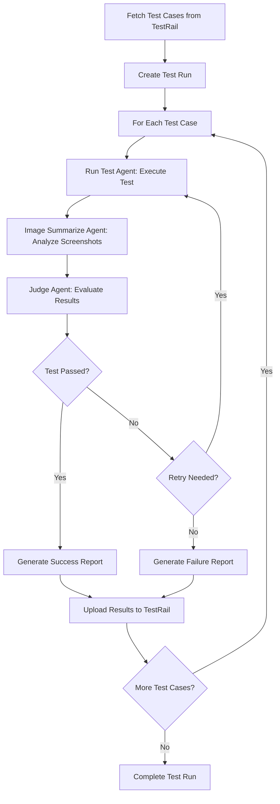

# Autotest Agent

An intelligent GitHub Action that automates mobile app testing by fetching test cases from TestRail, executing them on Android emulators using AI-powered agents, and uploading results back to TestRail.

## Overview

Autotest Agent combines the power of LLM-based AI agents with mobile automation to create a comprehensive testing solution. It integrates seamlessly with TestRail for test case management and uses a multi-agent architecture to execute tests, analyze results, and make intelligent judgments about test outcomes.

### Key Features

- **TestRail Integration**: Automatically fetches test cases and uploads results
- **Android Emulator Support**: Sets up and manages Android Virtual Devices (AVD)
- **AI-Powered Testing**: Uses LLM agents for intelligent test execution
- **Multi-Agent Architecture**: Employs specialized agents for different testing phases
- **Visual Analysis**: Screenshot-based verification and analysis
- **Automated Reporting**: Generates detailed test reports with visual evidence

## Agent Architecture

The system employs three specialized LLM agents working together to ensure comprehensive test coverage:

### 1. Run Test Agent (`agents/runtest.py`)
- **Purpose**: Executes test cases on the mobile device
- **Model**: Claude-4-Sonnet (default)
- **Capabilities**:
  - Controls mobile app through MCP (Model Control Protocol) tools
  - Opens target application (ScamCheck app)
  - Performs test steps based on TestRail descriptions
  - Retries failed tests up to 3 times
  - Prefers XML-based element location over coordinate-based actions

### 2. Image Summarize Agent (`agents/image.py`)
- **Purpose**: Analyzes screenshots and app states
- **Model**: GPT-4o-mini (default)
- **Capabilities**:
  - Processes base64-encoded screenshots
  - Provides detailed descriptions of app layout and content
  - Focuses on visible elements, colors, text, and UI components
  - Uses caching for improved performance

### 3. Judge Agent (`agents/judge.py`)
- **Purpose**: Evaluates test execution results
- **Model**: Claude-4-Sonnet (default)
- **Capabilities**:
  - Compares actual results against expected outcomes
  - Takes final screenshots for verification
  - Makes pass/fail decisions with detailed reasoning
  - Determines if retries are needed for failed tests
  - Generates comprehensive test reports

## Workflow Process



## How to Use This GitHub Action

### Prerequisites

1. TestRail account with API access
2. OpenAI-compatible API key (supports Claude, GPT, etc.)
3. Test suite configured in TestRail

### Basic Usage

Create a workflow file in your repository (`.github/workflows/autotest.yml`):

```yaml
name: Automated Mobile Testing

on:
  push:
    branches: [ main ]
  pull_request:
    branches: [ main ]
  schedule:
    - cron: '0 2 * * 1-5'  # Run weekdays at 2 AM

jobs:
  mobile-test:
    runs-on: ubuntu-latest
    
    steps:
    - name: Checkout code
      uses: actions/checkout@v4
    
    - name: Run Autotest Agent
      uses: your-username/autotest-agent@v1
      with:
        openai_api_base: ${{ secrets.OPENAI_API_BASE }}
        openai_api_key: ${{ secrets.OPENAI_API_KEY }}
        testrail_url: ${{ secrets.TESTRAIL_URL }}
        testrail_email: ${{ secrets.TESTRAIL_EMAIL }}
        testrail_api_key: ${{ secrets.TESTRAIL_API_KEY }}
        suite_id: ${{ secrets.SUITE_ID }}
```

### Advanced Configuration

```yaml
- name: Run Autotest Agent with Custom Settings
  uses: your-username/autotest-agent@v1
  with:
    # Required parameters
    openai_api_base: ${{ secrets.OPENAI_API_BASE }}
    openai_api_key: ${{ secrets.OPENAI_API_KEY }}
    testrail_url: ${{ secrets.TESTRAIL_URL }}
    testrail_email: ${{ secrets.TESTRAIL_EMAIL }}
    testrail_api_key: ${{ secrets.TESTRAIL_API_KEY }}
    suite_id: ${{ secrets.SUITE_ID }}
    
    # Optional Android emulator settings
    android_arch: 'x86_64'              # Default: arm64-v8a
    android_target: 'google_apis'       # Default: google_apis_playstore
    api_level: '30'                     # Default: 33
    android_build_tools_version: '30.0.3'  # Default: 33.0.2
    emulator_timeout: '600'             # Default: 350 seconds
    emulator_name: 'test_device'        # Default: nexus
    java_version: '11'                  # Default: 17
```

### Required Secrets

Configure these secrets in your repository settings:

| Secret Name | Description | Example |
|-------------|-------------|---------|
| `OPENAI_API_BASE` | API endpoint for LLM service | `https://api.openai.com/v1` |
| `OPENAI_API_KEY` | API key for authentication | `sk-...` |
| `TESTRAIL_URL` | Your TestRail instance URL | `https://yourcompany.testrail.io` |
| `TESTRAIL_EMAIL` | TestRail user email | `test@yourcompany.com` |
| `TESTRAIL_API_KEY` | TestRail API key | `abc123...` |
| `SUITE_ID` | TestRail test suite ID | `42` |

## Outputs and Artifacts

The action generates several outputs:

### Test Reports
- **Location**: `report/` directory
- **Format**: Markdown files with test results
- **Naming**: `✅/❌ TestName_timestamp.md`
- **Content**: Test description, execution logs, judgment details

### Screenshots
- **Location**: `screenshots/` directory
- **Format**: PNG files
- **Purpose**: Visual verification of test execution
- **Integration**: Linked in test reports

### TestRail Integration
- **Test Runs**: Automatically created for each execution
- **Results**: Pass/Fail status uploaded with detailed comments
- **Traceability**: Links execution results to original test cases

## Supported Android Configurations

| Parameter | Options | Default |
|-----------|---------|---------|
| Architecture | `arm64-v8a`, `x86_64`, `x86` | `arm64-v8a` |
| Target | `google_apis`, `google_apis_playstore`, `android-tv` | `google_apis_playstore` |
| API Level | `28`, `29`, `30`, `31`, `32`, `33`, `34` | `33` |
| Java Version | `8`, `11`, `17`, `21` | `17` |

## Contributing

1. Fork the repository
2. Create a feature branch
3. Make your changes
4. Add tests if applicable
5. Submit a pull request

## License

This project is licensed under the MIT License - see the LICENSE file for details.

## Support

For issues and questions:
- Open an issue in this repository
- Check the TestRail API documentation
- Review the OpenAI API documentation for LLM integration